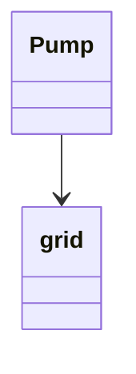

C\> prog.exe
1. startGame()
2. changeSettings()
Choose: 1
Choose Teams:
1. add(Player)
2. Continue()
if 2:
	You need at least two player in each team
else:
	Do you want s Saboteuer of do you want Plumber? [p]lumber [s]aboteur: p
	Name: Klevis
Player Kleivis is playins:
1. Fix() - fix current element you are staing apon
2. move() -
Move where?
- PUMP ID 1 
- PUMP IDE 2
....


test.txt
```
1
1
p
Klevis
```

C> prog.exe < test.exe

First test the sequence diagrams it the design.
We need to refine further:
- move()
	- moving to an active element
		- movint to cistern
		- move into pump
		- movt into sprng...
	- movint to pump

> [!warning]
> Then the application has to offer which scenario to check, and run the selected scenario. Each scenario contains just those objects that are necessary for checking the case

For different senarious we should have different grids so we need somehow to make it possible to select the senario, this also implies you need as less as possible objects to test the test case(the senario). You dont make a complicated grapth if you just have to test if the player can move from a pipe to a pump. (You only need the pipe and the pump).

#### Assosiation 
We say pump is using the grid as pump is asssosiated with the grid
Pummp{
	Grid grid;
}



> The classes of the skeleton only store associations, no other states! 

The states her mean the variables
C>
Here display everymetnod
choose:  (whicih method you want to test lest sppose puncure pipe)
puncreePipe()1 (wfadsfasdf)
puncurePipe()2 (asdfasfasdfa)
puncurePipe()3 (sDawdsasdsa)
%% 1. test case 1 (test cases are like what kind of grid it is)
2. test case 2
3. test case 3
Choose: 1
???progra.exe < testcase1_Setup.txt
```
1
1
p
Klevis
``` 
%%
This setsup for the test case abd then the user can enter other things.
What do you want to do next? ---


***When a method is called, it writes is name on the screen.*** The program should follow the basic 
scenarios (= use cases). It should display a text in the beginning, then it should offer the possibilities for the user 
to choose (eg: "Type 1 to start test case 1...), and follow the right path to give the right result. 

puncurePipe(){
	pipe.puncure()
}

Pipe(){
	puncure(){
		print("Pipe is Puncred")
	}
}

foo(){
print(foo)
 bar1()
 bar2()
 bar3()
}

bar1(){
print(bar1)
c1()
c2()
c3()
}

bar2(){
parint(bar2)
}

output
foo
bar1
bar2
bar3

c> prog.exe
startgame() 1 ()
startgame() 2  ()
startgame() 3   ()
puncreePipe()1 (wfadsfasdf)
puncurePipe()2 (asdfasfasdfa)
puncurePipe()3 (sDawdsasdsa)

For eahc one othem:
- how the syste in the the srat of the use case (are there already things in the fild or the plauer are already playing and so on)


S - system
U - user
5.2.10 (The plumber moved form pipe to pump)
Starting State:  Two pump and a pipe connected them and its the plumbers turn.
S: player::move() use case
S: Is the pump connected ore not?
U: yes
S: getSelectedElement()
S: addPlayer(plumber)
S: removePlayer(plumber)

component diagram we say who called them


