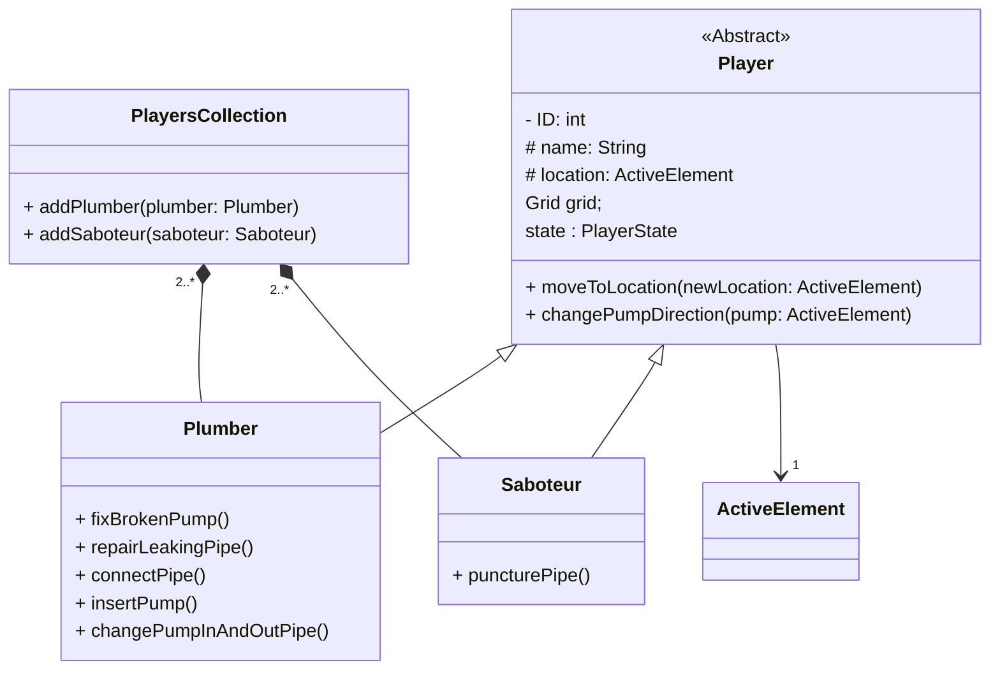

### Chapter 3.1- object catalogue:
For the Object Catalog is mentioned
>Short informal description (1-2 paragraphs/entity) of the entities playing important role in the problem domain

The problem domain comes from a subset of combines Graph, Game, and GUI problems. How the GUI should be is part of the problem that needs to be solved therefore we thing that the specification was note adequate. Furthermore, you can say that if you read the page then you would have read there is a graphical section. We knew there was a graphical section and because this is the part where we need to analyze the model we also logically thought we need to analyze how the GUI objects interact. You can clearly see that the GUI analyzed here it's just an abstracted model of the precise GUI implementation. 

> [!warning]
> We suggest for the next generation that the description also explicitly mentioned that no GUI elements should be analyzed.

### The Grid
From the teams perspective the grid is very important for the analyses model because is not only `a field on which to place the pipes / pumps, as the pipes and pumps`. 
Firstly, it ensures the consistency of the program. It checks that the players given can perform certain task. This should not be the task of individual components but of the logical consistency checker that is the grid. It's an abstraction that is easy to maintain because it separates the checking (consistency) from the individual components. This implies that extensibility is easier and the code is easier to maintain which is one of our requirements.
Secondly the grid contains elements which are `global`. Every element should now what the selected objects are. This information is provided by the grid and this also ensures that everyone knows that it is the same object selected (in other words: `consistency`). 
Thirdly, we have deeply though how the GUI will be implemented and we have come to conclusion the grid abstraction will allow us to that the right components are redrawn. The PipeGUI should only care about the pipe and PumpGUI about the pump. The GridGUI is the one who takes care that the updates are propagated to the other GUI elements of the grid. This is ***decoupling*** using layers of abstraction. You can whenever you like easily make new PumpGUI's and attach them to the program. This is another reason why the grid is there.
In the lights or the reason mentions, we can clearly think that the grid is fundamental to our program. The grid is a element of a ***well though design***.

### Players Collection
This has nearly the same role and idea as the grid. It is and an abstraction for GUI and maintain the consistency of the teams. Every teams should at least have 2 players. The Players Collection assures that. It is also important for running the game. Remember that the players are selected randomly. Who assures this? The Players Collection. You can argue about this because it is not included in the model, but there will be many thigs that are not included that will come up in the future during implementation. But because of good abstraction design choice for maintaining the consistency of the players the probability for errors in the development phase is significantly decreased. Just image, how would you even take care of players scattered everywhere in the active elements. How would you assure that the are not in some weird states. 

---
`We can have an EndOfPipe class, because if the pipe is connected to an active element, it will be difficult to take it’s end (the part the Plumber can take with him).` In the way we thought about the model there is not need for this object. We can discuss this on the class. 

---
>Made the Class Diagrams with the help of the skeleton code implementation

This is a miss understanding. The program we need to render the UML diagrams is called [# Mermaid Diagramming and charting tool]https://mermaid.js.org/ . You have to implement ***skeleton code*** in the mermaid language to render things.
Example:
To render the player diagram this was the mermaid code.
```Mermaid
classDiagram
 class Player {
    - ID: int
    # name: String
    # location: ActiveElement
    Grid grid;
   state : PlayerState 
    + moveToLocation(newLocation: ActiveElement)
    + changePumpDirection(pump: ActiveElement)
  }
  <<Abstract>> Player
  class ActiveElement {
  }
  class Plumber {
    + fixBrokenPump()
    + repairLeakingPipe()
    + connectPipe()
    + insertPump()
    + changePumpInAndOutPipe()
  }
  class Saboteur {
    + puncturePipe()
  }
 class PlayersCollection {
    + addPlumber(plumber: Plumber)
    + addSaboteur(saboteur: Saboteur)
  }

  Player <|-- Plumber
  PlayersCollection "2..*" *--  Plumber
  PlayersCollection "2..*" *-- Saboteur
  Player <|-- Saboteur
  Player --> "1" ActiveElement
```
This is how it looks rendered.


---
##### Sequence Diagrams
We sincerely think that we implemented everything. We can further discuss this on class.

---

### Conclusion
Considering the points raised, we hold the utmost respect for your expertise in this field. However, upon thorough examination, our team finds that many of the feedback points lack validity. Our team is always ready and open for discussion and guidance if you think that our assumptions are wrong.

> [!warning]
> With this letter we do not seek extra points as bargaining for points it is not a value of our team. This is only to address concerns regarding points that we see as unfit and unfair or we are unable to understand.
